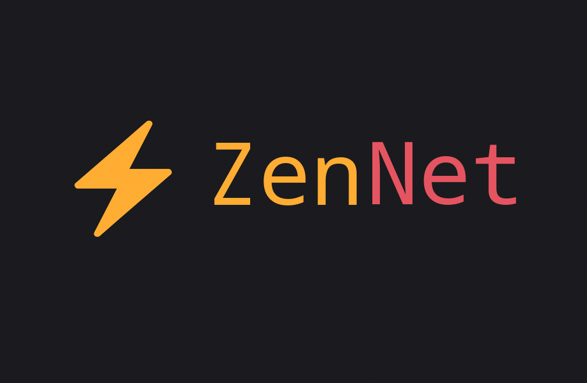

<p align="center">
    
</p>

<p align="center">ZenNet ⚡️</p>
<br>
<p align="center">
    
    
    
    
    
    </br>
</p>

 > *Fast as UDP, stable as TCP*

**ZenNet** is blazing-fast and feature-rich console program for analyzing network traffic.

> [!CAUTION]
> **zennet currently only supports Linux® distributions.** Other operating systems such as Windows, MacOS, BSD are not supported.

> [!CAUTION]
> At the moment, zennet is **under active development**, many things may not work, and this version is not recommended for use (all at your own risk).

## Advantages of zennet ⚡️
The zennet program is incredibly fast thanks to optimized calculations, asynchronous approach and multi-threading. 

Zennet also has beautiful data output and saves logs to a file (markdown format) out of the box.

## Speed ⚡️
zennet functions are faster than functions from standard Python libraries

### Sending a GET request using standard requests and zennet ⚡️
A request using the standard library is sent in approximately *~0.027* seconds

```python
# Standart library
import requests
from time import perf_counter

start = perf_counter()
requests.get('http://127.0.0.1:8000/login')
end = perf_counter()
total = round(end - start, 4)
print(total)

>>> 0.0277
```

And with the help of zenmap, the speed increased by about **138** times!

```bash
 $ python3 zennet.py --get --url http://127.0.0.1:8000/login -o localhost_login_zennet.md

>>> zennet v 0.2.2 @ alexeev-engineer
    GET /login HTTP/1.1 Host:127.0.0.1  
    ├── Код ответа:2 0 0
    ├── Заголовок ответа: {'Server': 'Werkzeug/3.0.1 Python/3.12.1', 'Date': 'Sun, 
    │   25 Feb 2024 16:17:43 GMT', 'Content-Type': 'text/html; charset=utf-8', 
    │   'Content-Length': '1549', 'Vary': 'Cookie', 'Connection': 'close'}
    ├── Время выполнения запроса: 0.0002
    └── Весь лог сохранен в localhost_login_zennet.md
    Время исполнения программы: 0.275 сек
```

## Requirements
To run the software you will have to install the necessary programs and dependencies, such as:

 + Python interpreter (>=3.10)
 + PIP package manager (>=22.0)
 + Python libraries (listed in [requirements.txt](./requirements.txt))

## Installion ⚡️
Don't forget to install dependencies and requirements: python>=3.10, pip and git.

> [!NOTE]
> If your shell is fish, then instead of `source venv/bin/activate` use `source venv/bin/activate.fish`.

```bash
git clone https://github.com/alexeev-engineer/zennet.git 			# Clone repo
cd zennet															# Change directory
python3 -m venv venv												# Create virtual environment
source venv/bin/activate											# Activate venv
pip3 install -r requirements.txt									# Install requirements.
```

## Contact and support
If you have questions about using zennet, then create an [issue](https://github.com/alexeev-engineer/zennet/issues/new) in the repository or write to me at bro.alexeev@inbox.ru.

You can also write to me on Telegram: [@alexeev_dev](https://t.me/alexeev_dev)

ZenNet is an Open Source project, and it only survives due to your feedback and support!

Project releases are available at [this link](https://github.com/alexeev-engineer/zennet/releases).

## Functional
Here you can see what SQLRMT can already do and what else is planned to be added in the future:

 - [x] Asynchrony support
 - [x] Logging
 - [x] Fast HTTP-get request
 - [x] Port scanner
 - [ ] Extensions support
 - [ ] Create GUI

## Copyright
ZenNet® - blazing fast tool network tool.

Copyright © 2024 Alexeev Bronislav. All rights reversed.

The registered trademark Linux® is used pursuant to a sublicense from LMI, the exclusive licensee of Linus Torvalds, owner of the mark on a world-wide basis.
